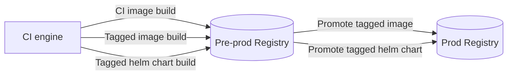

# springboot-demo1

Spring Boot demo application generated using the [Spring Initializr](https://start.spring.io/)

# Getting Started

## Software

Install Docker

* https://docs.docker.com/engine/install/ubuntu/

Using [Arkade](https://arkade.dev/) install additional dependencies

```
ark get kubectl helm buildx devspace k3d crane jq yq 
```

## Start cluster

```
k3d cluster create demo1
```

## Build and Deploy

```
devspace use namespace dev-01
devspace deploy
```

## Cleanup

```
devspace purge
k3d cluster delete demo1
```

# Install using Helm

This repository pushes both a docker image and an associoated helm chart to Github packages. This enables the software to be installed as follows:

```
helm upgrade demo1 oci://ghcr.io/myspotontheweb/argocd-workloads-demo/prod/charts/demo1 --version 1.0.14 --install --namespace demo1 --create-namespace
```

# Continuous Integration



Docker images

* A docker image build is triggered by each push to the repository.
* A docker image is **not** pushed to the docker registry for a pull request

A new version is generated by pushing a tag as follows. This will result in an additional helm chart being pushed to Docker registry

```
git tag vX.Y.Z -a -m "New release"
git push --tags
```

The CI logic is captured here

* [.github/workflows/ci.yaml](.github/workflows/ci.yaml)

A successfull build will trigger sync workflow in the GitOps workloads repo, controller ArgoCD

* [(myspotontheweb/argocd-workloads-demo) .github/workflows/updatecli.yaml](https://github.com/myspotontheweb/argocd-workloads-demo/blob/main/.github/workflows/updatecli.yaml)

# Reference Documentation
For further reference, please consider the following sections:

* [Official Apache Maven documentation](https://maven.apache.org/guides/index.html)
* [Spring Boot Maven Plugin Reference Guide](https://docs.spring.io/spring-boot/docs/3.0.6/maven-plugin/reference/html/)
* [Create an OCI image](https://docs.spring.io/spring-boot/docs/3.0.6/maven-plugin/reference/html/#build-image)
* [Caching Maven Dependencies with Docker](https://www.baeldung.com/ops/docker-cache-maven-dependencies)
* [Devspace](https://www.devspace.sh/)


