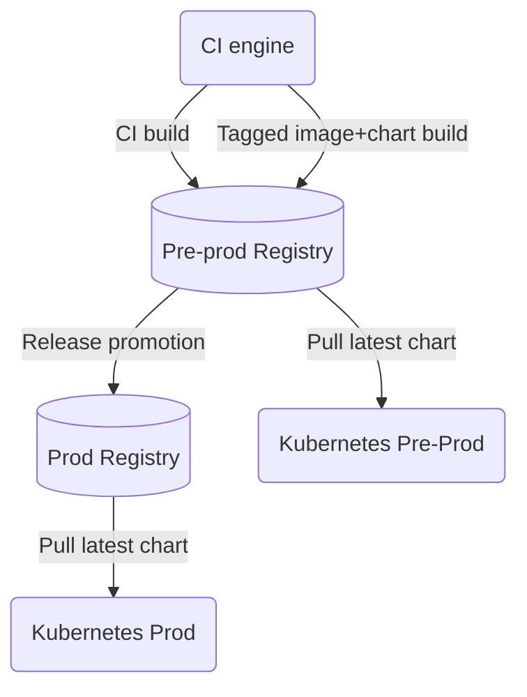

# springboot-demo1

Spring Boot demo application generated using the [Spring Initializr](https://start.spring.io/)

# Getting Started

## Software

Install Docker

* https://docs.docker.com/engine/install/ubuntu/

Using [Arkade](https://arkade.dev/) install additional dependencies

```
ark get kubectl helm buildx devspace k3d crane jq yq 
```

## Start cluster

```
k3d cluster create demo1
```

## Build and Deploy

```
devspace use namespace dev-01
devspace deploy
```

## Cleanup

```
devspace purge
k3d cluster delete demo1
```

# Install using Helm

This repository pushes both a docker image and an associoated helm chart to Github packages. This enables the software to be installed as follows:

```
helm upgrade demo1 oci://ghcr.io/myspotontheweb/argocd-workloads-demo/prod/charts/demo1 --version 1.0.14 --install --namespace demo1 --create-namespace
```

# Continuous Integration



The CI logic is captured here

* [.github/workflows/ci.yaml](.github/workflows/ci.yaml)

A successfull build will trigger sync workflow in the GitOps workloads repo, controller ArgoCD

* [(myspotontheweb/argocd-workloads-demo) .github/workflows/updatecli.yaml](https://github.com/myspotontheweb/argocd-workloads-demo/blob/main/.github/workflows/updatecli.yaml)


## CI build

When code is merged to "main" branch a Docker image is built and pushed to the Pre-prod Docker registry. This image is tagged using the SHA checksum of the latest Github commit.

## Tagged image+chart build

A new version is generated by pushing a tag on the main branch as follows:

```
git tag vX.Y.Z -a -m "New release"
git push --tags
```

This results in a new Docker image and chart being pushed into the pre-prod docker registry

## Release promotion

When is release is ready to be deployed to production a workflow copies the Docker image and Helm chart from the pre-prod docker registry into the prod docker registry

## Pull latest chart

We run two docker registries. One holds the releases for pre-production and the other holds the approved production releases.
A tool like [ArgoCD](https://argo-cd.readthedocs.io/en/stable/) allows us to run the latest helm chart on the matching Kubernetes cluster.

# Reference Documentation
For further reference, please consider the following sections:

* [Official Apache Maven documentation](https://maven.apache.org/guides/index.html)
* [Spring Boot Maven Plugin Reference Guide](https://docs.spring.io/spring-boot/docs/3.0.6/maven-plugin/reference/html/)
* [Create an OCI image](https://docs.spring.io/spring-boot/docs/3.0.6/maven-plugin/reference/html/#build-image)
* [Caching Maven Dependencies with Docker](https://www.baeldung.com/ops/docker-cache-maven-dependencies)
* [Devspace](https://www.devspace.sh/)


